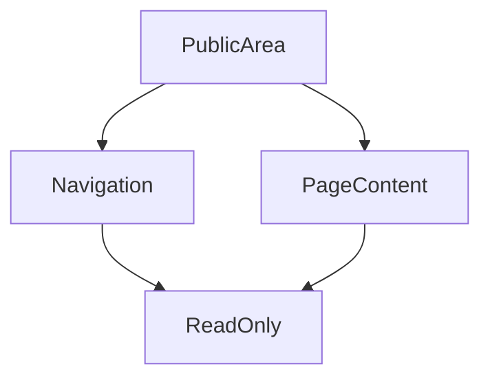
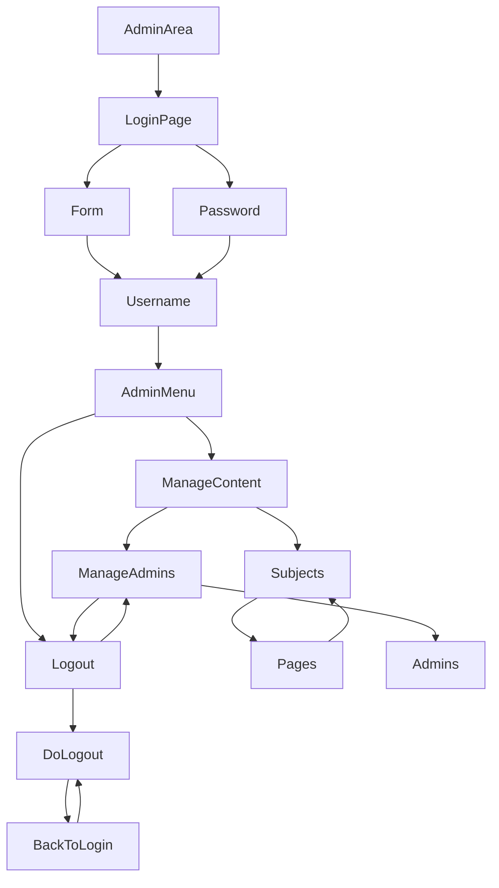

"# Content-Management-System" 

```mermaid
graph TD;
    PublicArea-->Navigation;
    PublicArea-->PageContent;
    Navigation-->ReadOnly;
    PageContent-->ReadOnly;
```

```mermaid
graph TD;
    AdminArea-->LoginPage;
    LoginPage-->Form;
    LoginPage-->Password;
    Form-->Username;
    Password-->Username;
    Username-->AdminMenu;
    AdminMenu-->ManageContent;
    AdminMenu-->Logout;
    ManageContent-->ManageAdmins;
    Logout-->ManageAdmins;
    ManageAdmins-->Logout;
    ManageContent-->Subjects;
    Subjects-->Pages;
    Pages-->Subjects;
    ManageAdmins-->Admins;
    Logout-->DoLogout;
    DoLogout-->BackToLogin;
    BackToLogin-->DoLogout;
```

```mermaid
graph TD;
    A-->B;
    A-->C;
    B-->D;
    C-->D;
```